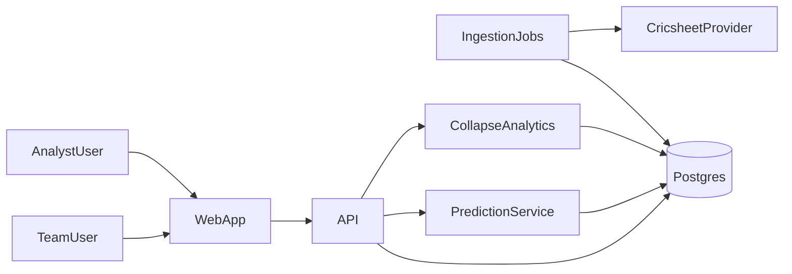

# PitchIQ — IPL Predicted XI + Collapse Intelligence (MVP Plan)

## Goals
- **Teams (franchises)** log in to a private portal, maintain a system of record (availability + notes), and generate a **predicted playing XI** for a match context with a **“Why this player?”** explanation panel.
- **General analysts** get a read-only league-wide dashboard (collapse risk + head-to-head explorer) based on public data + derived analytics.
- The system is **season-agnostic** (IPL 2008…2026 and future): everything is scoped by `Season`, and new seasons are added via an ingestion runbook.

## Locked product decisions
- **Starting XI definition**: *predicted* XI (pre-match, coach-actionable; not official toss XI).
- **Tenancy**: multi-tenant by franchise.
- **Visibility**:
  - Team users: own tenant-private notes + **public** opposition stats/history.
  - Analyst users: **public-only** derived analytics.
- **Data source (MVP)**: open datasets imported into DB (Cricsheet-style YAML/CSV). Keep a provider interface for future paid APIs.
- **AI engine (MVP)**: rules + weighted scoring, explainability-first (no black-box ML initially).

## Roles & permissions
- **LeagueAdmin (global)**: import seasons/data, create teams, invite users, manage venues.
- **TeamUser (tenant-scoped)**: manage private roster notes/availability; run predictions for their team; view public opposition stats.
- **AnalystUser (global read-only)**: league-wide analytics dashboards (collapse risk, H2H).

### Permission matrix (policy)
- **Private (tenant-only)**: `PlayerAvailability`, private roster notes, `MatchContext`, `ModelRun`.
- **Public/derived**: `PerformanceFact` is readable by everyone; writable by LeagueAdmin/ingestion.
- **Cross-tenant**: TeamUser can view public opposition stats/H2H but never private opposition notes/model runs.

## MVP pages (web)
### Auth
- `/auth/login`: email input → send magic link; resend cooldown.
- `/auth/verify`: verify token, set `httpOnly` cookie, redirect.

### Team home
- `/teams/[teamId]`
  - Header: team identity + **season switcher**.
  - Squad table (filterable): role, name, styles, nationality, availability badge.
  - **Slide-in PlayerCard** (not a new page): season avg/SR/econ, recent-form strip, venue & matchup snippets, availability + private notes (TeamUser only).
  - Opposition H2H section: opponent selector; last-10 meetings summary; top performers vs opponent.

### Match setup
- `/matches/[matchId]/setup`
  - Required context inputs: pitch type/condition, weather, dew, boundary size, toss (TBD allowed), pressure tag, home advantage, notes.
  - CTA: **Generate Predicted XI**.

### Predicted XI
- `/matches/[matchId]/predicted-xi`
  - XI cards in batting order (draggable) + bench (next 4).
  - “Why?” expander: top 3 positives, top 2 negatives, constraint violations (if excluded).
  - Side panel: context summary, **collapse risk gauge**, top 3 factors, composition checks (pace/spin ratio, overseas slots).
  - Actions: regenerate, export print/PDF view, save snapshot (persist `ModelRun`).

### Analyst dashboard
- `/analytics/collapse` (AnalystUser + LeagueAdmin)
  - Filters: season(s), venue(s), innings, dew, phase, bowling mix, opponent tier.
  - Outputs: probability gauge + factor attribution bars + similar matches table + venue×phase heatmap.

## Data model (Prisma-first; season-proof)
Implement the full schema from the spec (high-level entities):
- **Tenancy/auth**: `Tenant`, `User`, `Session`, `UserRole`.
- **League structure**: `Season`, `Team`, `Venue`, `Match`, enums for match phase + toss decision.
- **Players/squads**: `Player`, `SquadMembership`.
- **Private team inputs**: `PlayerAvailability` (+ status enums), private roster notes.
- **Match input form**: `MatchContext` (pitch/weather/dew/boundary/pressure/homeAdvantage).
- **Public derived analytics**: `PerformanceFact` (career/season/venue/matchup/recent_form + phase splits).
- **Audit + outputs**: `ModelRun` (predicted XI, bench, constraint log, feature weights, collapse risk + factors).
- **Ingestion tracking**: `IngestionJob` (status, errors, progress).

## Free data ingestion (Cricsheet-style)
- Use a `DataProvider` interface with a `CricsheetProvider` implementation.
- Dataset is a local, git-ignored drop: `data/cricsheet/ipl_YYYY/` (YAML/CSV).
- Ingestion pipeline:
  - Parse YAML/CSV → normalize players across seasons → upsert teams/venues/matches → ingest deliveries.
  - Recompute aggregates into `PerformanceFact`:
    - career, season, venue, matchup (vs team), phase splits, recent form (last 5 with decay 0.8).

## Predicted XI engine (rules_v1)
- Score each squad player \(0–100\) using weighted features:
  - recent form, season baseline, venue fit, pitch/dew impact,
  - opponent matchup splits, role-pressure fit,
  - workload penalty.
- Apply **hard constraints** before selection:
  - availability, **max overseas (default 4)**, min wicketkeeper,
  - minimum bowling options, role balance (top order/finisher mix).
- Persist `ModelRun` including per-player explanation payload:
  - top positive/negative factors + constraint violations.

## Collapse risk (MVP)
- **Collapse event definition**: 3+ wickets in 30 balls **and** < 30 runs in that window (any phase).
- **Model**: logistic regression inference with pre-shipped coefficients (`coefficients.json`).
- **Explainability**: factor attribution = weight × feature value; sort by absolute contribution.
- Return: probability \(0–1\), factors, and similar historical matches for the given filters.

## Suggested tech stack (matches spec)
- Next.js (App Router) + TypeScript (strict)
- Postgres + Prisma
- Tailwind + shadcn/ui
- Recharts for charts
- js-yaml + papaparse for parsing
- Resend for magic-link email
- node-cron for simple jobs

## High-level architecture

